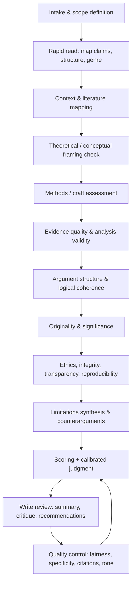

# Rigorous Critical-Review Framework for Any Scholarly or Creative Work

## Executive summary

This report provides a reusable, **rigorous critical-review framework** you can apply to scholarly articles, essays, reports, and creative works. It is designed to produce two complementary outputs: **(a) a fair, accurate account of what the work claims and does**, and **(b) a defensible evaluation of how well it succeeds**, supported by transparent criteria and (when relevant) reporting- and ethics-guideline benchmarks (e.g., reporting checklists and publication-ethics standards). Key guideline ecosystems emphasized include the entity["organization","EQUATOR Network","reporting guidelines library"] (which indexes many study-design reporting guidelines), the entity["organization","Committee on Publication Ethics","publication ethics org"] (publication ethics core practices and flowcharts), and the entity["organization","American Psychological Association","psychology association us"] reporting standards (JARS). citeturn0search28turn0search4turn0search2

The framework includes: (1) an **executive-summary template** for a critical review; (2) a detailed **step-by-step review methodology** spanning scope, context, literature mapping, theory, methods, evidence quality, argument structure and coherence, originality, significance, ethics, reproducibility/transparency, and limitations; (3) **explicit checklists and scoring rubrics** (quantitative + qualitative) usable for quick triage or deep appraisal; (4) an **800–1,200 word exemplar review** with placeholders for article metadata and concrete praise/critique sentences; (5) guidance for **genre adaptation** (empirical, theoretical, policy, creative); (6) a curated set of **primary/official standards and guidelines** to prioritize; (7) suggested **visual aids**, including tables and a Mermaid flowchart; and (8) a **time budget** by stage plus a deliverables checklist.

Assumptions (explicit): you have access to the full work (including any appendices/supplements if they exist); you can consult cited sources as needed; and your goal is to produce a review that is useful either for an academic audience (peer review / journal club / seminar) or for decision-making (e.g., adopt a policy, fund a project, teach a text). Where discipline-specific norms differ, the “Standards & sources” section shows how to swap in field standards rather than forcing one-size-fits-all rules. citeturn0search28turn8search14

## Review outputs and executive-summary template

A strong critical review is easiest to write if you treat it as a **bundle of traceable artifacts**, not just prose. The framework below assumes you will generate: (i) a 1–2 paragraph executive summary, (ii) a structured critique, (iii) a scoring sheet, and (iv) a short “actionable recommendations” list (for authors, editors, decision-makers, or readers).

### Concise executive summary template for a critical review

Use this as the first block in your final review (edit brackets).

**Work reviewed**: \[Author(s)\], \[Year\], *\[Title\]*, \[Venue/Publisher\], \[Genre/Study type\], \[DOI/URL if applicable\].

**Purpose and central claim**: The work argues that \[core thesis in 1 sentence\] and seeks to demonstrate \[primary objective\] using \[approach: empirical/theoretical/policy analysis/creative method\].

**Main contributions**: Its most important contributions are \[C1\], \[C2\], and \[C3\]. These contributions matter because \[why they matter to field/practice/aesthetic tradition\].

**Assessment in brief**: Overall, the work is **\[excellent/strong/adequate/weak\]**. It is strongest in \[2–3 strengths, tied to criteria\] and weakest in \[1–2 high-impact weaknesses\]. The most consequential limitation is \[limitation\], which affects \[validity/generalizability/interpretation/ethical acceptability\] by \[mechanism\].

**Evidence and reasoning quality**: The evidence is \[high/moderate/low\] quality given \[design/data/source constraints\]. The argument’s logic is \[coherent/partly coherent/incoherent\], mainly due to \[key inference steps\].

**Transparency, reproducibility, ethics**: Transparency is \[high/moderate/low\] because \[data/code/materials availability; reporting completeness\]. Ethical safeguards are \[clearly addressed/partly addressed/not addressed\] with respect to \[consent, harm, conflicts, representation\]. (If applicable, note alignment with reporting/ethics standards.)

**Actionable recommendations**: Priority improvements are: (1) \[highest ROI fix\], (2) \[second fix\], (3) \[third fix\]. For readers/practitioners, the safest takeaway is \[bounded conclusion\]; avoid \[overreach\] unless \[conditions\].

This structure deliberately separates: **what the work is** → **what it claims** → **how well it supports those claims** → **what to do next**.

## Step-by-step methodology for conducting a rigorous review

The methodology below is written “genre-neutral,” then annotated with where you would swap in design-specific standards (e.g., CONSORT/STROBE/PRISMA, policy appraisal guidance, or craft/aesthetic criteria).

### Review process flowchart

### Stage-by-stage method (with artifacts and “failure modes”)

**Stage one: Intake, scope, and “review contract” (pre-commitment)**  
1) **Define your review purpose** (why are you reviewing?): peer-review recommendation, learning, policy decision, teaching syllabus, editorial assessment, or creative criticism.  
2) **Define scope boundaries**: what you will and will not evaluate (e.g., “evaluate internal validity and transparency, not novelty” or “evaluate narrative coherence and thematic originality, not historical accuracy unless claimed”).  
3) **Create an assumption log** (one paragraph): what you assume about audience, disciplinary norms, and access to underlying materials; list what would change your judgment if wrong.  
Artifact: a 5–10 line “Review Contract” you keep in your notes.

Common failure mode: reviewing a paper “as if it were” a different genre (e.g., treating a theory paper like an RCT report).

**Stage two: Rapid read to map structure and claims (orientation pass)**  
4) Skim the abstract, intro, headings, conclusion, and figures/tables (or, for creative works: opening/closing, structural breaks, motif occurrences).  
5) Write a **one-sentence thesis** and a **three-bullet contribution list** in your own words (do not copy).  
6) Produce a **claim inventory**: list the work’s major claims as “C1…Cn.” For each claim, note where it appears (section/page) and what kind of support it *seems* to use (data, example, citation, reasoning, aesthetic technique).

Artifact: “Claim inventory + map to sections.”

Common failure mode: critiquing peripheral choices while missing the work’s central claim.

**Stage three: Context and literature mapping (situating the work)**  
7) Identify the **intellectual neighborhood**: Which debates is it entering? Which established findings or canons does it rely on?  
8) Build a **mini literature map** (10–25 sources depending on depth). Include: (a) the work’s cited “foundational” references; (b) 3–5 recent or canonical counterpoints; (c) 2–3 methodological standards or best-practice guidelines relevant to its design.  
9) Evaluate citation use: does the work cite appropriately for background vs. contested claims? Are there obvious omissions that bias interpretation?

Artifact: annotated mini-bibliography or concept map.

Common failure mode: treating “has citations” as “has adequate engagement.” A good context review checks *coverage, balance, and relevance*, not just count.

If the work is a systematic review, anchor expectations against PRISMA 2020 reporting elements (e.g., transparent selection and reporting). PRISMA 2020 provides a structured checklist and flow-diagram templates to support complete reporting. citeturn0search13turn0search1turn0search22

**Stage four: Theoretical framing and conceptual clarity (what concepts do the arguments require?)**  
10) Extract definitions of key constructs (explicit or implicit). For each, ask:  
- Is the construct operationalized (if empirical) or exemplified and delimited (if theoretical/creative)?  
- Are boundaries clear (what is excluded)?  
- Are levels of analysis consistent (individual vs. group vs. system)?  
11) Test the conceptual chain: do definitions support the variables/interpretations later used?  
12) Identify the “silent premises”: what must be true for the argument to work?

Artifact: “Concept table” (term → definition → evidence/anchor → downstream use).

Common failure mode: missing that an argument fails because a key concept shifts meaning mid-text (equivocation).

**Stage five: Methodology or craft assessment (design adequacy, not personal preference)**  
13) Identify the work’s **methodological spine**: design type, sampling/selection, measurement, analysis, interpretive procedure; or, for creative works, formal devices, constraints, narrative architecture, voice, point of view, imagery systems.  
14) Assess **design fit to question**: is the chosen approach capable of answering the stated question (not “ideal,” but “fit for purpose”)?  
15) Check specification: could a competent reader reconstruct what was done (or how the work was built) from what is reported?

For empirical health and social science designs, reporting-guideline families provide a practical benchmark for “minimum information needed to appraise.” For example, STROBE provides checklists for observational study reporting. citeturn1search5turn1search1  
For randomized trials, CONSORT 2025 states that the guideline includes a checklist and a participant flow diagram to support clear and transparent reporting. citeturn1search20turn1search16  
For qualitative interviews/focus groups, COREQ is a 32-item checklist oriented to team/reflexivity, study methods, context, analysis, and interpretation. citeturn1search3turn1search19  
For qualitative reporting more broadly, SRQR provides synthesized reporting recommendations. citeturn0search11

**Stage six: Evidence quality and analysis validity (trustworthiness of support)**  
16) Build an **evidence matrix**: claim → evidence type → quality assessment → alternative explanations.  
17) Evaluate evidence along the appropriate validity axes:  
- Empirical: internal validity, measurement validity, confounding, bias, robustness, uncertainty quantification.  
- Theoretical: inferential validity, consistency with premises, handling of objections, scope conditions.  
- Policy: data quality, causal plausibility, stakeholder impacts, uncertainty, distributional effects.  
- Creative: textual evidence for interpretation, coherence of motifs/themes, formal control, emotional and ethical resonance.

18) For quantitative work: sanity-check the analytic pipeline (transformations, models, assumptions, robustness). For mixed methods: check integration logic (do methods genuinely inform each other or sit side-by-side?).

Common failure mode: “methodological name-dropping” substituting for valid inference.

**Stage seven: Argument structure and logical coherence (is the reasoning sound?)**  
19) Produce an **argument outline** in 8–15 lines: premises → intermediate inferences → conclusion.  
20) Stress-test with three questions:  
- Where could the conclusion be true even if the evidence is weak? (overgeneralization risk)  
- Where could the evidence be true but the conclusion still false? (invalid inference risk)  
- What would falsify or seriously revise the claim? (testability and humility)

Artifact: argument map (claim–warrant–backing–rebuttal).

Common failure mode: confusing rhetorical force with logical support.

**Stage eight: Originality and significance (what is new, and does it matter?)**  
21) Distinguish types of originality: new data, new method, new synthesis, new concept, new form/voice, new ethical stance, new application.  
22) Evaluate significance relative to the work’s stated ambition: local contribution vs. field-shaping claim.  
23) Check whether novelty is achieved by ignoring relevant work (false originality).

**Stage nine: Ethics, integrity, transparency, reproducibility (can we trust the research practice?)**  
24) Publication and research ethics checks: conflicts of interest, authorship transparency, data integrity concerns, plagiarism/self-plagiarism risks, respectful representation and harm minimization. The COPE Core Practices outline expectations across misconduct handling, authorship, conflicts of interest, and data/reproducibility as part of ethical publishing practice. citeturn0search4turn0search8  
25) Authorship/contributorship clarity: ICMJE specifies four authorship criteria as a standard reference point in medical-journal contexts. citeturn2search0turn2search12  
26) Reproducibility/transparency checks: data/code/materials availability, preregistration/registration when relevant, and completeness of reporting (design-specific checklists). Open-science policy frameworks (e.g., TOP Guidelines) provide modular standards intended to increase verifiability of empirical claims. citeturn2search2turn2search14  
27) Data stewardship expectations where relevant: FAIR principles emphasize findability, accessibility, interoperability, and reuse orientation, especially for data/metadata. citeturn2search3turn2search7

Common failure mode: treating ethics as a checkbox rather than assessing **how ethical choices shape validity, harm, and trust**.

**Stage ten: Limitations and counterarguments (intellectual honesty)**  
28) Evaluate whether limitations are: (a) acknowledged, (b) correctly prioritized, and (c) actually integrated into conclusions.  
29) Add your own: list the top 3 limitations by impact, and propose realistic mitigations.  
30) Consider “steelmanning”: restate the strongest version of the author’s argument before critiquing it.

**Stage eleven: Scoring and calibrated judgment (turn evidence into decision)**  
31) Score using the rubric in the next section, but treat the score as *a summary of reasons*, not a substitute for them.  
32) Identify “fatal flaws” versus “fixable issues.” A single severe flaw (e.g., fatal confounding, unethical methods, fabricated data suspicion) should outweigh many minor strengths; COPE flowcharts provide structured responses when misconduct is suspected. citeturn8search8turn8search2turn8search5

**Stage twelve: Write and quality-control (fairness, specificity, usefulness)**  
33) Separate **description** (neutral summary) from **evaluation** (criteria-based judgment).  
34) Use “show your work”: quote or point to specific passages, figures, or scenes; avoid vague adjectives.  
35) Tone discipline: critique the work’s choices and implications, not the author’s character or motives.

## Checklists and scoring rubrics with explicit criteria

### Table comparing criteria across core dimensions (universal checklist)

Use this table as your “all-genres radar.” It specifies (a) what to examine, (b) what good looks like, and (c) common failure modes.

| Dimension | What to examine | High-quality indicators | Common failure modes |
|---|---|---|---|
| Scope & purpose | Stated aim, audience, success criteria | Clear research/creative question; matched ambition | Undefined goal; moving targets; genre mismatch |
| Context & literature/canon mapping | Key references, omissions, positioning | Balanced engagement; accurate framing of debates | Cherry-picking; false novelty; strawman opponents |
| Theoretical/conceptual clarity | Definitions, construct boundaries, premises | Stable terms; explicit assumptions; coherent framework | Concept drift; unexamined premises; category errors |
| Methods / craft adequacy | Design fit; procedural detail; craft choices | Reconstructable process; justified choices | Incomplete reporting; method-as-ornament; incoherent form |
| Evidence / support quality | Data integrity; textual evidence; robustness | Appropriate, triangulated support; uncertainty handled | Overclaiming; weak evidence; confounds; selective examples |
| Argument structure & logic | Claim–evidence–warrant chain | Valid inferences; rebuttals; scope conditions | Non sequiturs; equivocation; causal leaps |
| Originality | Novel contribution type | Genuine advancement; clear differentiation | “New” via ignorance; novelty without value |
| Significance | Stakes, implications, transferability | Clear contribution; plausible impact; bounded claims | Hype; vague “implications”; mismatch with evidence |
| Ethics & integrity | Consent, harm, bias, COI, authorship | Ethical safeguards; transparent COI; respectful portrayal | Unreported COI; unethical methods; exploitative framing |
| Transparency & reproducibility | Data/code/materials; reporting completeness | Shareable artifacts; detailed methods; auditability | Opaque pipeline; unavailable data; irreproducible claims |
| Limitations & reflexivity | What could be wrong and why | Prioritized limits; humility; future work specifics | Token limitations; ignored alternative explanations |
| Communication quality | Structure, clarity, figures, style | Reader-guiding; precise language; usable visuals | Obscurity; rhetorical fog; figure–text mismatch |

### Explicit checklists (copy/paste into your review notes)

**Checklist A: “Claim–Support–Scope” (fast but deep)**  
Mark each claim C1…Cn and answer:

- C#: \[claim\]  
  - Support type: \[data / citation / example / reasoning / aesthetic technique\]  
  - Support adequacy: ☐ strong ☐ mixed ☐ weak ☐ missing  
  - Scope: ☐ appropriately bounded ☐ somewhat overstated ☐ clearly overstated  
  - Alternative explanations/counter-readings acknowledged? ☐ yes ☐ partial ☐ no  
  - What would change my mind? \[falsifier/strong counterevidence\]

**Checklist B: “Transparency & integrity” (evidence of trustworthy practice)**  
- Conflicts of interest disclosed and plausible? ☐ yes ☐ partial ☐ no citeturn0search4turn2search20  
- Authorship/contribution clarity (e.g., meets recognized criteria or uses contributorship taxonomy)? ☐ yes ☐ partial ☐ no citeturn2search0turn2search1  
- Methods detailed enough to reconstruct (or replicate where relevant)? ☐ yes ☐ partial ☐ no  
- Data/code/materials availability stated and aligned with claims? ☐ yes ☐ partial ☐ no citeturn2search2turn9search3  
- Ethical approvals/consent (if applicable) documented? ☐ yes ☐ partial ☐ no citeturn7search0turn7search1  
- Any red flags (image anomalies, implausible results, citation padding)? ☐ none ☐ some ☐ serious

**Checklist C: “Methodology fit” (empirical/theoretical/policy/creative)**  
- Does the method/craft *actually answer* the question/aim? ☐ yes ☐ partial ☐ no  
- Are key choices justified (not merely conventional)? ☐ yes ☐ partial ☐ no  
- Are limitations structurally addressed (robustness checks; narrative constraints; policy uncertainty)? ☐ yes ☐ partial ☐ no

### Quantitative scoring rubric

**Recommended scale (0–4) used across all dimensions**  
- **4 (Exemplary)**: best-practice level; choices justified; transparent; limitations integrated; minimal avoidable weaknesses.  
- **3 (Strong)**: solid quality; minor issues; conclusions mostly appropriately bounded.  
- **2 (Adequate)**: acceptable but with notable weaknesses; conclusions require tightening; improvements needed for reliability/impact.  
- **1 (Weak)**: major deficits in evidence/method/logic; high risk of misleading conclusions; substantial revision needed.  
- **0 (Unacceptable / not assessable)**: missing critical information; fatal flaw; or violates core ethical/integrity expectations.

You then score each dimension and compute a weighted total.

**Weights (default, discipline-neutral)**  
If you need a single composite score, default weights can prevent “style points” from dominating validity:

- Scope & purpose: 5%  
- Context & literature mapping: 10%  
- Theoretical clarity: 10%  
- Methods/craft adequacy: 15%  
- Evidence/support quality: 15%  
- Argument logic/coherence: 15%  
- Originality: 10%  
- Significance: 10%  
- Ethics & integrity: 5%  
- Transparency & reproducibility: 10%  
- Limitations/reflexivity: 5%  
- Communication quality: 5%

**How to compute**  
Overall score (0–4) = Σ(weightᵢ × scoreᵢ) / Σ(weightᵢ).

**Interpretation bands (suggested)**  
- **3.5–4.0**: outstanding; model of practice (minor edits only).  
- **2.8–3.4**: strong; publishable/assignable with revisions.  
- **2.0–2.7**: mixed; substantial revision or cautious use.  
- **1.0–1.9**: weak; likely unreliable or ineffective without redesign.  
- **0–0.9**: unacceptable / cannot responsibly rely on.

### Qualitative rubric (narrative, decision-ready)

Use this alongside the numeric score; it prevents “false precision.”

- **Endorse**: claims are supported; limitations understood; transparency adequate; ethical risks low; contribution real.  
- **Endorse with conditions**: valuable contribution but requires explicit re-scoping, additional robustness checks, or reporting fixes.  
- **Do not endorse (yet)**: promising idea but evidence/method/logic not currently sufficient; major work needed.  
- **Do not endorse (critical)**: severe validity or integrity/ethics concerns; conclusions not trustworthy or harms likely.

### Sample scoring table (blank template)

| Dimension | Weight | Score (0–4) | Evidence / notes (1–3 lines) | Priority fix |
|---|---:|---:|---|---|
| Scope & purpose | 0.05 |  |  |  |
| Context & literature mapping | 0.10 |  |  |  |
| Theoretical clarity | 0.10 |  |  |  |
| Methods / craft adequacy | 0.15 |  |  |  |
| Evidence / support quality | 0.15 |  |  |  |
| Argument logic / coherence | 0.15 |  |  |  |
| Originality | 0.10 |  |  |  |
| Significance | 0.10 |  |  |  |
| Ethics & integrity | 0.05 |  |  |  |
| Transparency & reproducibility | 0.10 |  |  |  |
| Limitations & reflexivity | 0.05 |  |  |  |
| Communication quality | 0.05 |  |  |  |

## Sample critical review using placeholders (exemplar, 800–1,200 words)

**Work reviewed**: \[Author(s)\], \[Year\], *\[Article Title\]*, \[Journal/Conference/Publisher\], \[DOI/Identifier\].  
**Genre / design**: Scholarly empirical article (observational/mixed-methods suggested by text, but not specified here).  
**Reviewer purpose**: Critical appraisal for a graduate seminar (validity + contribution + transparency).

**Summary and central claim**  
In *\[Article Title\]*, \[Author(s)\] argue that **\[central thesis\]**, claiming that \[phenomenon/intervention/exposure\] leads to \[outcome\] through \[mechanism\]. The article’s goal is both explanatory (“why/how does this occur?”) and, implicitly, normative (“what should be done about it?”). The authors support their position using \[data source or corpus\], analyzed via \[method\], and frame the contribution as addressing a gap in \[field/debate\].

A helpful way to restate the article is as three linked claims: (C1) \[descriptive claim\]; (C2) \[causal/interpretive claim\]; and (C3) \[implication or recommendation\]. The paper’s narrative is organized around these claims, moving from background context to results and then to a discussion that generalizes beyond the studied setting.

**Strengths (with concrete praise language)**  
The article’s strongest asset is **clarity of motivation**. The introduction makes a persuasive case that \[problem\] matters for \[stakeholders/field\], and it gives readers enough orientation to understand why the question is nontrivial. A sentence like: *“The authors clearly distinguish what is already known from what remains uncertain, which gives the study a focused rationale.”* captures this strength.

Second, the paper demonstrates **methodological intentionality** in \[a specific choice—e.g., sampling frame, triangulation, or analytic strategy\]. For instance, the decision to \[use multiple measures / include sensitivity analyses / incorporate qualitative triangulation\] is aligned with the work’s ambition to connect description with explanation. Example praise sentence: *“The analytic plan is generally well-matched to the main research question, and the study design choices are explained rather than treated as self-evident.”*

Third, the discussion offers **conceptual usefulness** by proposing \[a model, typology, mechanism, or interpretive lens\] that could transfer to related contexts. Even where one disagrees with the conclusion, the conceptual scaffold is a productive object for future debate. Example praise sentence: *“The proposed framework is generative: it yields testable downstream hypotheses and clarifies what kinds of evidence would be most diagnostic.”*

**Major concerns (validity, support, and inference)**  
The most consequential weakness is a **gap between the strength of the evidence and the breadth of the claims**. While (C1) is reasonably supported by the presented materials, (C2) is treated as if it follows automatically. A representative critique sentence would be: *“The results are consistent with the authors’ favored explanation, but the paper does not adequately rule out plausible alternative mechanisms, which makes the causal language in the conclusion too strong.”*

Relatedly, the article under-specifies key methodological details needed for readers to audit inference quality. It is not always clear \[how cases were selected / how missing data were handled / whether coding was double-checked / whether model assumptions were tested\]. This matters because the credibility of (C2) depends on these details—especially where the argument turns on subtle differences. Example critique language: *“Several decision points in the pipeline (e.g., inclusion/exclusion rules, operational definitions, and robustness checks) are described at a high level, limiting the reader’s ability to evaluate whether analytic flexibility could have materially shaped the findings.”*

A second major concern is **conceptual slippage**. The term *\[key concept\]* appears to mean \[definition A\] in the introduction, but later functions more like \[definition B\]. Because the main argument relies on that term as the bridge between evidence and implication, this shift creates ambiguity about what has actually been shown. Example critique sentence: *“The paper would benefit from a tighter definitional discipline: at present, the key construct does not remain stable across sections, which weakens the inferential chain from measurement to interpretation.”*

Third, the literature positioning is somewhat one-sided. The article cites \[tradition\] extensively, but gives limited treatment to \[competing tradition\] that would pressure-test the authors’ assumptions. The issue is not “missing citations” per se; it is that the absence affects how readers interpret novelty and robustness. Example critique sentence: *“The framing would be more convincing if the authors engaged directly with the strongest counter-position in the literature, rather than implying consensus where the field is actively contested.”*

**Transparency, reproducibility, and research integrity considerations**  
The article’s transparency is mixed. On the positive side, \[some elements are shared: instruments, partial code, appendix, thick description\]. On the negative side, the paper does not provide \[data access pathway, codebook, preregistration, or replication materials\] in a way that would allow independent verification (even partial). This does not automatically invalidate conclusions, but it does lower confidence and slows cumulative progress. Example critique sentence: *“The credibility of the central estimates/interpretations would be materially strengthened by sharing the analytic code and a de-identified dataset or a documented access procedure, alongside a clear provenance statement for the data.”*

Ethically, the work appears to consider \[consent/privacy/harm\], but the discussion is brief relative to the sensitivity of \[population/topic\]. If the work involves human subjects or sensitive content, readers need to know how risks were minimized and how representation choices were justified. Example critique sentence: *“Given the potential downstream harms of misinterpretation or stigmatization, the paper should more explicitly address ethical safeguards and positionality, particularly in how categories are defined and reported.”*

**Limitations and recommendations for improvement**  
Although the authors mention limitations, they are not prioritized by impact on conclusions. The limitation most likely to change interpretation is \[limitation\], because it could produce the observed pattern even if the hypothesized mechanism is false. I recommend three concrete revisions: (1) sharpen the claims by stating explicit scope conditions (what contexts/populations the findings do *not* cover); (2) add \[robustness check / alternative model / negative control / reflexivity detail\] to address the strongest alternative explanation; and (3) expand the transparency package (materials + code + data pathway) to enable verification.

**Overall evaluation**  
This is a **promising and often insightful** contribution with clear motivation and some strong design choices, but its headline claims currently outrun what the evidence strictly supports. With stronger conceptual stabilization, fuller reporting of analytic decisions, and a more explicit engagement with counterarguments, the paper could become a reliable reference rather than a provocative—but fragile—argument.

## Adapting the framework for different genres

The same evaluation dimensions apply across genres, but **what counts as “evidence,” “validity,” and “reproducibility” changes**. Use the table below as a translation key.

| Genre | What “methods” means | What “evidence quality” means | What “reproducibility” means | Add-on checks |
|---|---|---|---|---|
| Empirical quantitative | Design, sampling, measures, stats | Bias/confounding, measurement validity, robustness, uncertainty | Data/code/materials + complete reporting | Design-specific reporting checklist; sensitivity analyses |
| Empirical qualitative | Sampling logic, reflexivity, coding/interpretation | Credibility, transferability, triangulation, transparency of interpretation | Audit trail, codebook, reflexivity documentation | COREQ/SRQR alignment; positionality and ethics depth |
| Theoretical / conceptual | Argument construction, definitions, inference rules | Validity of reasoning, internal consistency, handling objections | Reconstructability of the argument and sources used | Counterexample stress tests; scope conditions |
| Policy / evaluation report | Appraisal model, causal logic, cost/benefit, uncertainty | Data provenance, causal plausibility, distributional impacts, uncertainty management | Traceable assumptions, replicable calculations, transparent data sources | Uncertainty & distributional analysis standards |
| Creative work | Form, structure, voice, imagery, character, pacing | Textual richness, coherence, innovation, thematic integrity | Not “replication,” but transparency about constraints/process if claimed | Ethical representation, cultural context, interpretive generosity |

### Design- and domain-specific swaps (practical guidance)

- **Empirical studies**: choose an appropriate reporting guideline based on study type. The entity["organization","EQUATOR Network","reporting guidelines library"] library is the fastest starting point for mapping design → checklist. citeturn0search28  
  - Observational: STROBE checklists. citeturn1search5turn1search1  
  - Randomized trials: CONSORT (updated in 2025) with checklist and flow diagram. citeturn1search20turn1search16  
  - Systematic reviews: PRISMA 2020 checklist and related resources. citeturn0search1turn0search22  
  - Diagnostic accuracy: STARD 2015 checklist. citeturn5search3turn5search11  
  - Prediction models / ML clinical prediction: TRIPOD+AI (noting it supersedes earlier TRIPOD guidance). citeturn1search18turn1search14  
  - Case reports: CARE checklist. citeturn3search2turn3search6  
  - Animal research: ARRIVE 2.0 Essential 10 (minimum) and broader items (best practice). citeturn3search5turn3search9  
  - Intervention description: TIDieR checklist and guide supports replicable intervention reporting. citeturn6search10turn6search2  
  - Sex/gender reporting: SAGER checklist supports routine reporting of sex/gender considerations across design, analysis, results, interpretation. citeturn6search1turn6search13

- **Policy reports**: import explicit uncertainty, distributional effects, and appraisal logic standards. For example, entity["organization","Office of Management and Budget","us executive office"] Circular A-4 provides U.S. federal guidance for regulatory analysis. citeturn3search3turn3search35 The entity["organization","HM Treasury","uk finance ministry"] Green Book is UK government guidance on appraisal and evaluation (costs/benefits/risks). citeturn4search0turn4search4 The entity["organization","OECD","intergovernmental organization"] DAC criteria define six evaluation criteria (relevance, coherence, effectiveness, efficiency, impact, sustainability). citeturn4search1turn4search5  
  In policy reviews, weight “methods/evidence/uncertainty” more heavily than “originality,” unless the report explicitly claims methodological invention.

- **Creative works**: replace “methodology assessment” with “craft and form assessment,” and replace “reproducibility” with “interpretive accountability.” Your evidence matrix becomes **interpretation → textual/formal evidence → alternative reading → payoff**. Ethics becomes central when representation decisions shape harm, stereotyping, appropriation, or reader manipulation. If the work claims factuality (memoir, docu-fiction), add a “truth-claims audit” as in policy.

## Recommended primary sources and authoritative guidelines to prioritize

This is a shortlist of **high-authority, primary/official** sources that map cleanly onto the framework’s dimensions. Use them as “defaults” unless your discipline has a more specific standard.

### Publication ethics, integrity, and authorship

- entity["organization","Committee on Publication Ethics","publication ethics org"]: Core Practices (baseline expectations across misconduct handling, conflicts of interest, data/reproducibility, etc.). citeturn0search4turn0search8  
  COPE also provides flowcharts for responding to suspected issues (e.g., plagiarism, fabricated data, concerns raised post-publication), which can inform your integrity-risk appraisal. citeturn8search8turn8search2turn8search5  
- entity["organization","International Committee of Medical Journal Editors","medical journal editors group"]: authorship is defined by four criteria in ICMJE recommendations (commonly used benchmark in medicine and beyond). citeturn2search0turn2search12  
- entity["organization","National Information Standards Organization","us standards body"]: CRediT taxonomy (14 contributor roles) supports transparency of contributions beyond author order. citeturn2search1turn2search25

### Reporting and study-design transparency (choose by design)

- entity["organization","EQUATOR Network","reporting guidelines library"]: central index for reporting guidelines; useful for quickly aligning study type with the right checklist. citeturn0search28  
- PRISMA 2020: systematic review reporting checklist and resources (statement paper + checklists). citeturn0search19turn0search22  
- CONSORT 2025: updated reporting guideline for randomized trials with checklist and flow diagram. citeturn1search20turn1search16  
- STROBE: observational study reporting checklists (cohort/case-control/cross-sectional). citeturn1search5turn1search1  
- STARD 2015: diagnostic accuracy reporting checklist. citeturn5search3turn5search7  
- COREQ and SRQR: qualitative research reporting guidance and checklists. citeturn1search19turn0search11  
- CARE: case report reporting checklist. citeturn3search2turn3search6  
- ARRIVE 2.0: animal research reporting (Essential 10 as minimum). citeturn3search5turn3search9  
- TIDieR: intervention description and replication checklist/guide. citeturn6search10turn6search2  
- CHEERS 2022: reporting standards for health economic evaluations (28-item checklist). citeturn4search2turn4search10turn4search30  
- AGREE II and RIGHT: guideline quality appraisal and guideline reporting tools, respectively. citeturn5search1turn5search2turn5search6

### Reproducibility and open science (policy frameworks)

- entity["organization","Center for Open Science","open science nonprofit"]: TOP Guidelines provide modular transparency standards intended to increase verifiability of empirical claims. citeturn2search2turn2search14  
- FAIR principles (findable, accessible, interoperable, reusable) are a widely cited conceptual anchor for data stewardship. citeturn2search3turn2search7  
- entity["organization","National Institutes of Health","us biomedical research agency"]: guidance on rigor and reproducibility clarifies what reviewers look for in assessing rigor, transparency, and reproducibility elements in grant contexts (useful as a general quality lens). citeturn3search0turn3search8  
- entity["organization","Nature Portfolio","scientific journal group"]: reporting standards and reporting-summary requirements illustrate how some high-impact venues operationalize transparency expectations. citeturn9search3turn9search7  
- entity["organization","UNESCO","un agency education science"]: the Recommendation on Open Science provides an international policy frame for equitable open science practices. citeturn7search2turn7search26

### Policy analysis and evaluation standards

- entity["organization","Office of Management and Budget","us executive office"] Circular A-4 (Regulatory Analysis) for benefit–cost analysis and transparent regulatory appraisal. citeturn3search3turn3search35  
- entity["organization","HM Treasury","uk finance ministry"] Green Book (Appraisal and Evaluation): structured framework for evidence-based policy appraisal of costs/benefits/risks. citeturn4search0turn4search4  
- entity["organization","OECD","intergovernmental organization"] evaluation criteria: relevance, coherence, effectiveness, efficiency, impact, sustainability as a normative evaluation frame. citeturn4search1turn4search5

### Writing, style, and discipline norms (helpful when reviewing essays and creative criticism)

- entity["organization","Modern Language Association","humanities scholarly society"]: MLA style resources and MLA Handbook as a reference point for humanities writing and documentation norms. citeturn9search4turn9search0  
- entity["organization","IEEE","professional organization engineering"]: author ethics and publishing-ethics guidance can inform integrity expectations in engineering/computing publication contexts. citeturn9search2turn9search10  
- entity["organization","Association for Computing Machinery","computing society"]: artifact review and badging policy provides a concrete framework for evaluating the availability and validation of computational artifacts. citeturn6search0turn6search4

## Time budget by stage, suggested deliverables, and QC checklist

### Estimated time budget (baseline: “standard rigorous review” of one work)

Assumption: one journal article or report of ~20–40 pages (or an equivalently complex creative work).

| Stage | What you do | Deliverable | Typical time |
|---|---|---|---:|
| Intake & scope | Define purpose, boundaries, assumptions | Review contract + assumption log | 15–30 min |
| Rapid claim mapping | Skim, extract thesis + claims | Claim inventory | 30–45 min |
| Context mapping | Identify debates, key comparators, standards | Mini literature map | 45–90 min |
| Theory/concepts | Definitions, conceptual chain audit | Concept table | 30–60 min |
| Methods/craft audit | Design fit + reconstruction test | Methods/craft notes | 60–120 min |
| Evidence/analysis audit | Evidence matrix + robustness checks | Evidence matrix | 60–150 min |
| Logic & coherence | Argument map + counterargument test | Argument outline | 30–60 min |
| Ethics & transparency | COI/authorship, ethics safeguards, reproducibility | Integrity/transparency notes | 30–60 min |
| Scoring & synthesis | Rubric scoring + key takeaways | Scoring sheet | 20–40 min |
| Writing | Executive summary + critique + recommendations | Final review draft | 60–120 min |
| Quality control | Fairness, specificity, tone, citations | Final pass checklist | 15–30 min |

Total: ~6–12 hours depending on complexity and how much external context you build.

### “Scaled” options (when time is constrained)

- **Rapid triage (90–150 minutes)**: do intake → rapid mapping → methods/evidence triage → coherence check → score + 1-page review.  
- **Standard review (6–8 hours)**: full pipeline, modest literature map, full scoring.  
- **Deep review (12–20 hours)**: full pipeline + deeper literature map + (if possible) limited reproducibility checks (re-running code, verifying calculations, auditing sources).

### Deliverables checklist (what you should have at the end)

Use as a final self-audit:

- ☐ Review contract (purpose, scope, assumptions)  
- ☐ Claim inventory (C1…Cn) with section/page anchors  
- ☐ Mini literature/canon map (incl. standards/checklists relevant to the design/genre) citeturn0search28  
- ☐ Concept table (key constructs, definitions, downstream use)  
- ☐ Evidence matrix (claim → evidence → quality → alternatives)  
- ☐ Argument outline (premises → inferences → conclusion; rebuttals)  
- ☐ Ethics & transparency notes (COI/authorship/data availability/ethical safeguards) citeturn0search4turn2search0turn2search2  
- ☐ Completed scoring table + brief justification per dimension  
- ☐ Final critical review with: neutral summary, strengths, weaknesses, actionable recommendations  
- ☐ Quality-control pass: specificity, fairness/steelman, tone, no overclaiming, and (when relevant) guideline alignment

### Quality-control questions (last pass before “publishing” your review)

- **Fidelity**: Could the author recognize their work in your summary?  
- **Traceability**: Does each major critique point to a specific place/evidence?  
- **Proportionality**: Are the strongest claims matched to the strongest evidence?  
- **Counterfactual fairness**: Would your critique still hold if the author were someone you admire?  
- **Actionability**: Does the review tell the author/reader exactly what to improve or how to interpret responsibly?